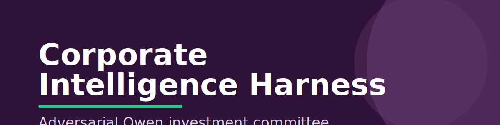
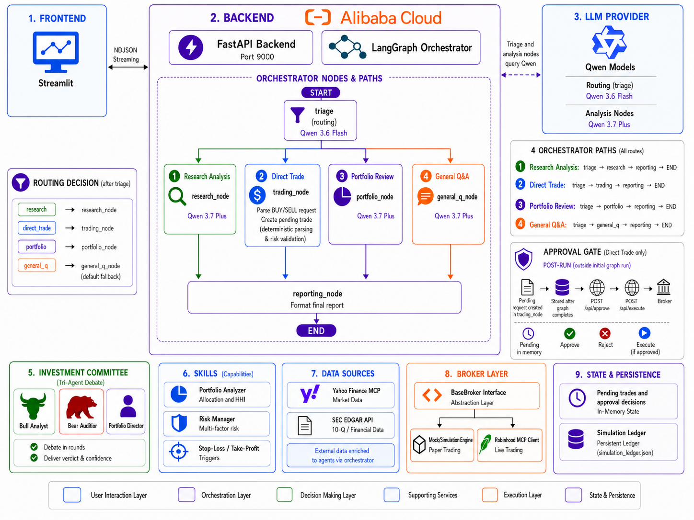

<div align="center">
  

  <h2>Market intelligence, adversarially tested before execution.</h2>

  <p>
    <strong>Corporate Intelligence Harness</strong> uses Alibaba Qwen to turn a plain-English market question into a cited investment committee report. Its FastAPI backend runs serverlessly on Alibaba Cloud and pauses for human approval before any simulated or broker-backed trade executes.
  </p>

  <p>
    
    
    
    
    
    
    
  </p>

  <p><em>Built for the Qwen Cloud x Hackathon - Track 4: Autopilot Agent.</em></p>

  <h3>
    <a href="#what-it-does">What it does</a> ·
    <a href="#see-it-in-action">See it in action</a> ·
    <a href="#why-its-an-agent">Why it's an agent</a> ·
    <a href="#architecture">Architecture</a> ·
    <a href="#quick-start">Quick start</a> ·
    <a href="#security">Security</a>
  </h3>
</div>

---

## The problem

Investment workflows are noisy: facts are scattered across filings and market feeds, AI summaries can sound confident without evidence, and trading automation becomes risky the moment it skips human judgment.

Corporate Intelligence Harness solves that by forcing every research answer through a small adversarial committee. A Bull Analyst and Bear Auditor debate the same immutable evidence. A Portfolio Director weighs the arguments, produces a cited verdict, and only then creates an approval request for the human operator.

## What it does

| Capability | How it works |
|---|---|
| Ambiguous request routing | Qwen triage classifies user input as `research`, `direct_trade`, `portfolio`, or `general_q`. |
| Evidence-backed research | Parallel fetches combine Yahoo Finance market data with SEC EDGAR 10-Q fundamentals. |
| Adversarial analysis | Bull and Bear personas argue in parallel, then rebut with prior-round context. |
| Human approval gates | Trades pause with a `request_id` until an operator approves or rejects them. |
| Broker abstraction | Simulation mode is default, with Robinhood MCP support behind the same broker interface. |
| Transparent reporting | Inline citation markers map report claims back to source payloads. |

## See it in action

Try these prompts in the Streamlit UI:

```text
Analyze NVDA
Buy $500 of TSLA
Show my portfolio
What is a P/E ratio?
```

The backend streams progress as NDJSON, so the frontend can show each step as it happens: triage, data fetch, committee debate, approval checkpoint, execution, and final report.

## Why it's an agent

This is not a single prompt wrapped in a UI. The system chooses a path, invokes external tools, coordinates multiple specialist personas, preserves workflow state, and asks for human confirmation before taking irreversible action.

**Track 4 alignment**

| Criterion | Implementation |
|---|---|
| Ambiguous input handling | Four-path Qwen triage with structured output and confidence. |
| External tool invocation | Yahoo Finance, SEC EDGAR, broker clients, and reusable portfolio skills. |
| Human-in-loop gates | Approval checkpoint before any order execution. |
| End-to-end workflow | Query -> Triage -> Committee -> Approval -> Execution -> Report. |
| MCP integration | Robinhood MCP client wired through the broker abstraction layer. |

## Architecture

<p align="center">
  <a href="ARCHITECTURE.md">
    
  </a>
</p>

<p align="center"><sub>Open the diagram for detailed architecture notes.</sub></p>

**BUY/SELL execution path**

```text
direct_trade -> trading_node -> pre-trade risk validation
             -> human approval -> broker execution -> cited report
```

## Quick start

### Prerequisites

- Python 3.12
- A DashScope API key for Alibaba Qwen
- Optional: Robinhood OAuth credentials for live broker integration

### Local development

```bash
pip install -r requirements.txt
cp .env.example .env
# Edit .env and set DASHSCOPE_API_KEY plus any broker settings.

python -m uvicorn backend:app --host 0.0.0.0 --port 9000 --reload
streamlit run frontend.py
```

Open the Streamlit URL, then run a research prompt such as `Analyze NVDA`.

### Cloud deployment

- Frontend: Streamlit Community Cloud
- Backend: Alibaba Cloud Function Compute 3.0
- Runtime: Python 3.12 on `custom.debian11`
- Streaming: `/api/analyze/stream` over NDJSON

See [deployment/DEPLOYMENT_ALIBABA.md](deployment/DEPLOYMENT_ALIBABA.md) for production setup.

## API reference

### Stream analysis

```bash
POST /api/analyze/stream
{"user_input": "Analyze NVDA"}
```

Returns NDJSON log events followed by a result event.

### Approve or reject a trade

```bash
POST /api/approve/{request_id}
{"approved": true, "approver_notes": "Strong fundamentals confirmed."}
```

### Execute an approved trade

```bash
POST /api/execute/{request_id}
```

### Portfolio

```bash
GET /api/portfolio
```

Returns holdings, live prices, P&L, and concentration risk.

## Configuration

```bash
DASHSCOPE_API_KEY=your_dashscope_key
QWEN_MODEL=qwen3.7-plus
QWEN_TEMPERATURE=0.3
QWEN_TOP_P=0.85
DASHSCOPE_ENDPOINT=https://dashscope-intl.aliyuncs.com/compatible-mode/v1

BROKER_TYPE=simulation
ROBINHOOD_CLIENT_ID=
ROBINHOOD_CLIENT_SECRET=

BACKEND_PORT=9000
```

## Project structure

```text
backend.py                         FastAPI endpoints and NDJSON streaming
frontend.py                        Streamlit UI and approval controls
orchestrator.py                    LangGraph workflow nodes
app/agents/investment_committee.py Tri-agent debate and director verdict
app/llm/qwen_integration.py        Qwen client and structured output helpers
app/tools/sec_tools.py             SEC EDGAR 10-Q extraction
app/tools/external_tools.py        Yahoo Finance and external data tools
app/trading/                       Broker interface, simulation, Robinhood MCP
skills/                            Reusable portfolio and risk skills
test_backend.py                    Backend API smoke test
```

## Security

- Keep API keys in `.env`, Streamlit Secrets, or Alibaba Function Compute environment variables.
- Default to `BROKER_TYPE=simulation` for demos and development.
- Require explicit approval before every trade execution.
- Treat live Robinhood integration as optional and experimental. Keep `ROBINHOOD_TRADING_ENABLED=false` outside a private environment with valid credentials.
- Do not commit `.env`, broker credentials, OAuth secrets, or generated ledgers with sensitive account data.

## Documentation

- [ARCHITECTURE.md](ARCHITECTURE.md) - Design decisions and component details
- [IMPLEMENTATION.md](IMPLEMENTATION.md) - Implementation notes
- [deployment/DEPLOYMENT_ALIBABA.md](deployment/DEPLOYMENT_ALIBABA.md) - Alibaba Cloud deployment

## Troubleshooting

| Symptom | Fix |
|---|---|
| `DASHSCOPE_API_KEY not set` | Add the key to `.env` or your cloud environment. |
| SEC EDGAR timeout | Retry after the first warm-up call; filings can be slow to parse. |
| Frontend shows offline | Confirm `BACKEND_API_URL` points to the deployed backend. |
| Port already in use | Change `BACKEND_PORT` or start uvicorn on another port. |
| Streamlit shows old code | Reboot the Streamlit app or push a new commit. |

## Observed performance

An individual Qwen call typically takes **7-20 seconds**, while triage can take up to 8 seconds. Full research invokes multiple model calls across two debate rounds and a Director verdict, so end-to-end latency can reach 2-3 minutes. Timings vary with model load, portfolio size, external data latency, and cold starts.

| Operation | Typical time |
|---|---:|
| Qwen triage and routing | Up to 8 s |
| Individual Qwen analysis call | 7-20 s |
| Parallel data fetch | 1-3 s |
| Committee debate and Director verdict | 1-2 min |
| Portfolio analysis | 10-30 s |
| Full research query | 2-3 min |
